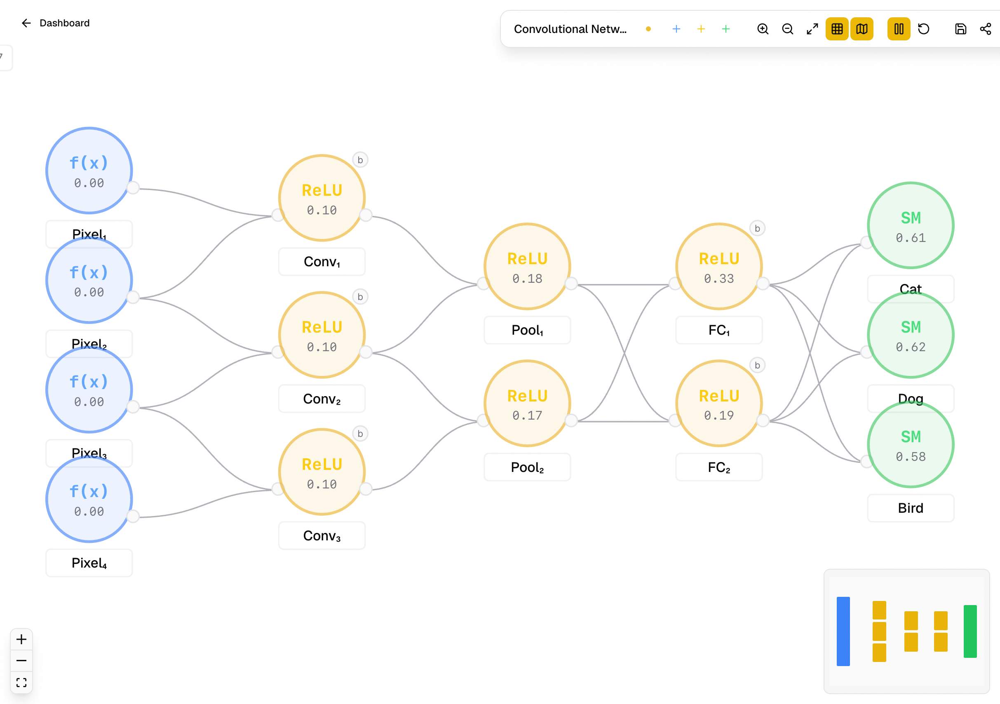

<div align="center">
  <h1>NNN - Neural Network Nook</h1>
  <p>NN on a canvas.</p>
</div>

A modern SaaS web application for visually designing and experimenting with neural network architectures. Built with Next.js 15, React Flow, and Framer Motion.

## Screenshots

<div align="center">
    <picture >
        <source media="(prefers-color-scheme: dark)" srcset="public/screenshot-dark.png" />
        
    </picture>
</div>

## Quick Start

### 1. Clone & Install

```bash
git clone https://github.com/s4nj1th/nnn
cd nnn
npm install
```


### 2. Run locally

```bash
npm run dev
```

Open [http://localhost:3000](http://localhost:3000)


## Theme System

The app supports **Light**, **Dark**, and **System** themes using `next-themes`.

- 5 accent colour variants (Yellow, Blue, Purple, Green, Orange)
- CSS custom properties for all design tokens
- Smooth 200ms transitions, no flash on load

## Tech Stack

- **Framework** — Next.js 15 App Router
- **UI** — React 19, Tailwind CSS, shadcn/ui, Lucide Icons
- **Canvas** — React Flow (@xyflow/react)
- **State** — Zustand + zundo (undo/redo)
- **Animations** — Framer Motion
- **Forms** — React Hook Form + Zod
- **Theme** — next-themes

## License

This project is licensed under the MIT License. See the [LICENSE](LICENSE) file for details.
