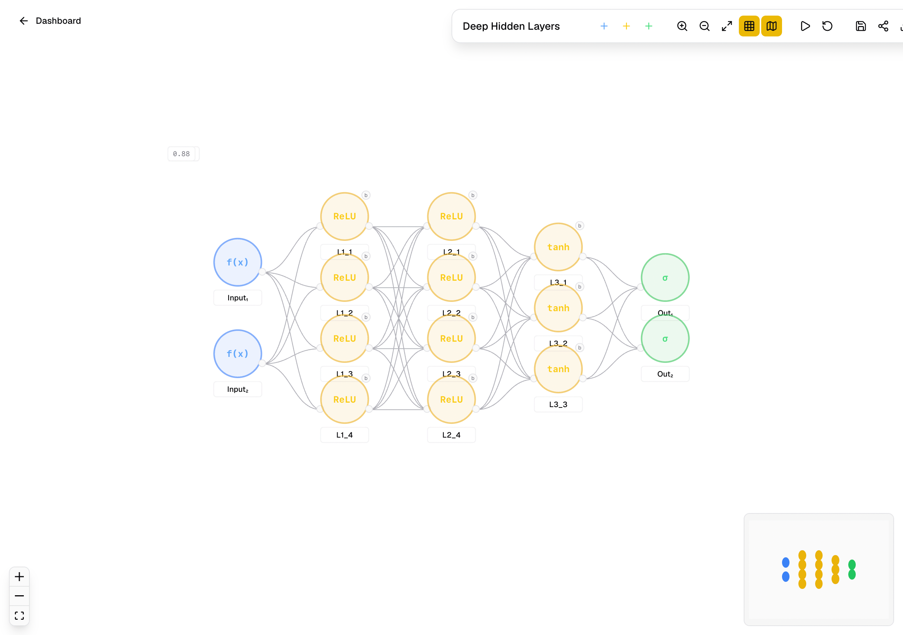
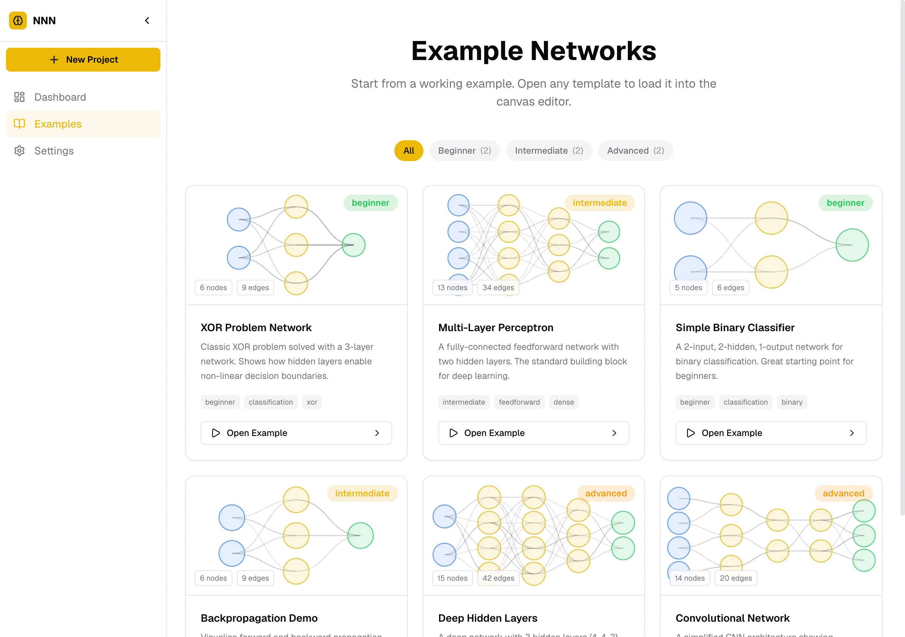

<div align="center">
  <h1>NNN - Neural Network Nook</h1>
  <p>NN on a canvas.</p>
</div>

A modern visual playground for designing, simulating, and experimenting with neural network architectures right in your browser. Fully local, highly responsive, and built with Next.js 15, React Flow, and Framer Motion.

## Screenshots

<div align="center">
    <picture >
        <source media="(prefers-color-scheme: dark)" srcset="public/screenshot-01-dark.png" />
        
    </picture>
    <picture >
        <source media="(prefers-color-scheme: dark)" srcset="public/screenshot-02-dark.png" />
        
    </picture>
</div>

## Features

- **Fully Client-Side**: All projects and editor state are saved locally in your browser's `localStorage`-no sign-up, databases, or cloud dependencies required.
- **Interactive Simulation**: Run inputs through your node network, step through forward propagation, and adjust edge weights on the fly.
- **Visual Editing**: Create layers, add inputs/outputs/hidden neurons, select activation functions, and layout your architecture visually.
- **Dynamic WebP Thumbnails**: Automatically generates minimalist, vector-like circular node thumbnails of your network graphs when saving/closing, displayed instantly on your dashboard.
- **Example Gallery**: Browse prepopulated neural network templates (like XOR gates, basic logic gates, and deep networks) with instant preview thumbnails generated in the background.
- **Rich Exports**: Export your network architectures in multiple formats:
  - **JSON**: Full canvas state to backup or re-import later.
  - **SVG**: Clean vector art that scales infinitely.
  - **PNG**: 2× retina-ready raster graphics.
- **Inline Renaming**: Easily rename projects directly within the editor toolbar.
- **Clean Grid & Minimap**: Highly visible dark/light theme grids and a circular-node minimap for smooth workspace navigation.
- **Undo/Redo**: Full history tracking with zundo.

## Quick Start

### 1. Clone & Install

```bash
git clone https://github.com/s4nj1th/nnn
cd nnn
npm install
```

### 2. Run locally

```bash
npm run dev
```

Open [http://localhost:3000](http://localhost:3000)

## Theme System

The app supports **Light**, **Dark**, and **System** themes using `next-themes` with clean transitions, zero flash on load, and custom CSS variables configured for both grid dots and canvas elements.

## Tech Stack

- **Framework** - Next.js 15 App Router
- **UI** - React 19, Tailwind CSS, shadcn/ui, Lucide Icons
- **Canvas** - React Flow (@xyflow/react)
- **State & Persistence** - Zustand + `zustand/persist` (Local Storage) + zundo (Undo/Redo)
- **Animations** - Framer Motion
- **Theme** - next-themes

## License

This project is licensed under the MIT License. See the [LICENSE](LICENSE) file for details.
